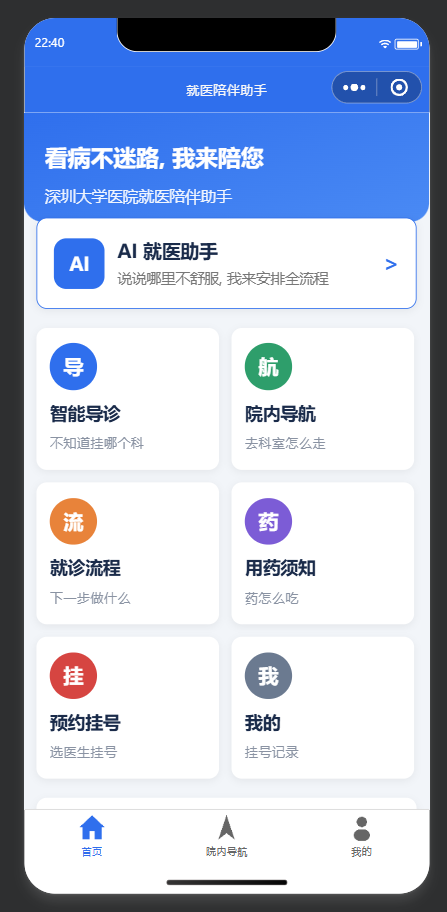
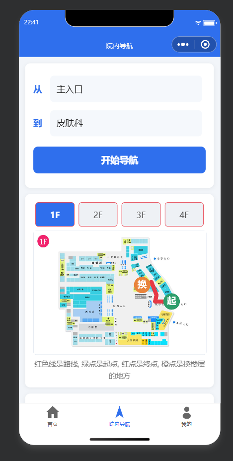
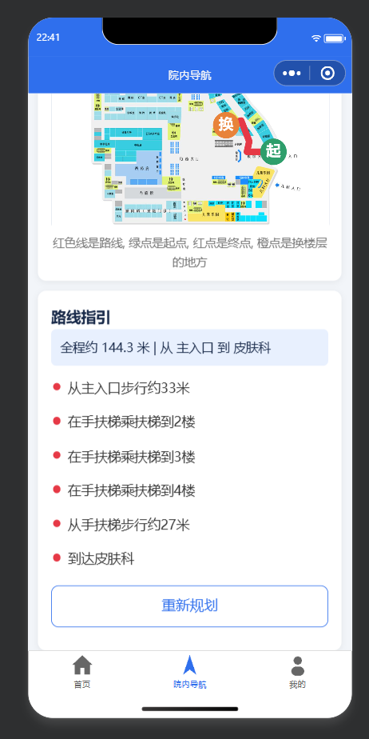
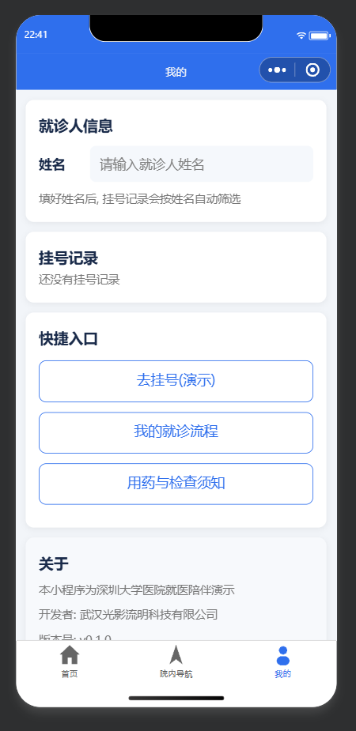
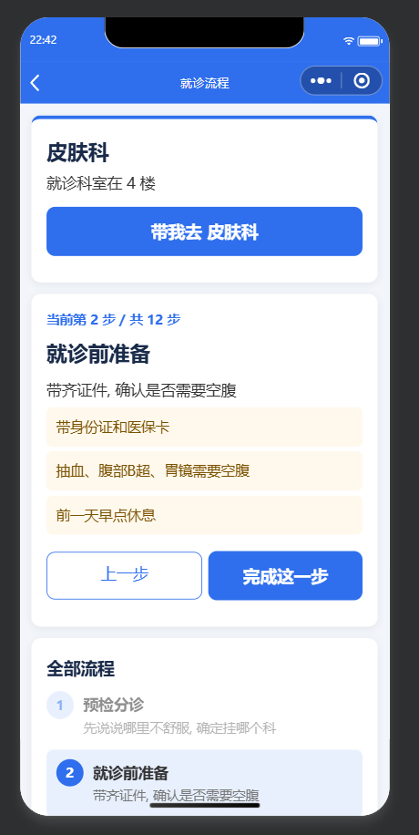
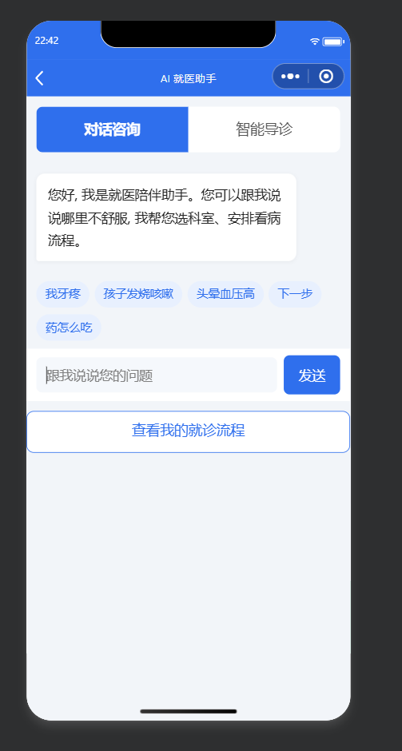

# 就医辅助 hospital-guide

> 就医辅助 就医助手 医院辅助 医疗辅助 就医。融合AI辅助与智能寻路，每个步骤都支持检索和引路。数据来源深圳大学医院公开数据，数据仅用于展示和调试，请勿用于任何非法用途。适用于AI大赛、创新创业大赛等，使用需注明来源，购买版权请联系。

## 效果截图

  
  

## 功能

- 智能导诊：说症状，推荐科室与检查须知
- 就诊流程卡：12 步全流程（分诊到复诊），每步一键导航
- 院内导航：平面图上画路线，多楼层自动换乘（电梯/扶梯/楼梯）
- AI 对话：小米 MiMo 大模型，大白话答疑
- 用药与检查须知：空腹、憋尿等注意事项大字版
- 挂号演示：真实医生数据（410 位）本地演示流程

## 快速开始

1. 安装依赖：`pip install -r input/api/requirements.txt`
2. 配置模型：复制 `.env.example` 为 `.env`，填入大模型 key（OpenAI 兼容接口）
3. 初始化数据库：`python input/database/init_db.py`
4. 启动后端：`python -m uvicorn input.api.main:app --reload`（接口文档 http://127.0.0.1:8000/docs）
5. 微信开发者工具导入 `miniprogram/` 目录（AppID 用测试号即可），编译运行

后端地址在 `miniprogram/utils/config.js`，真机预览改为电脑局域网 IP。环境要求：Python 3.10+、微信开发者工具。

## 目录结构

```
input/       数据与接口层（FastAPI、SQLite、平面图、路网、医生数据）
asset/       核心层（Dijkstra 多楼层寻路、就诊流程状态机、LLM 编排、路网标注工具）
miniprogram/ 微信小程序（原生, 7 页面, 适老化大字 UI）
output/      输出层（透传接口, 见 output/接口约定.md）
爬虫/        医生数据爬取脚本
```

## 换一家医院

平面图放 `input/data_source/floor_maps/`，用 `asset/tools/map-annotator.html` 标注路网导出 JSON，
改 `input/database/seed_data.py` 后重跑 `init_db.py`。`asset/` 与 `miniprogram/` 代码无需改动。

## 常见问题

- 启动报 WinError 10013：8000 端口被占用，关闭占用进程
- 小程序提示"无法连接服务"：后端未启动或 `utils/config.js` 地址不对
- AI 不回答：检查 `.env` 的 key；模型不可用时自动降级为知识库回答，流程推进不受影响

## 致谢

- 寻路设计参考 simpleroutingsvg（SVG 室内地图 + Dijkstra），源码附在 `simpleroutingsvg-master/`
- 医生数据来自深圳大学医院公开信息

## 执照

MIT License，版权归属武汉光影流明科技有限公司。商用授权购买请联系。
